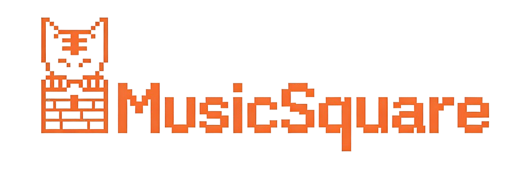

  

# 🌟 Overview

MusicSquare is a simple music search, download, and play website. 
It provides a lightweight, browser-friendly interface to search, play, and download music directly from your GitHub Pages site.

This GitHub Pages deployment is available at:

👉 **Live URL:** <https://theodoreye001.github.io/musicsquare/>

## ✨ Key Features

- 🎵 **Online music search & playback**  
  Supports searching songs by keyword and playing them directly in the browser.

- 📻 **Multiple music sources**  
  Integrates online platforms such as Migu, Netease, Kuwo and QQ.

- 💛 **Clean & simple UI**  
  A clean, minimalist interface for casual music listening.

## 🚀 How to Use

1. Open the live site:  
   👉 <https://theodoreye001.github.io/musicsquare/>

2. Use the search box to input an artist name or song title (e.g., “周杰伦”).

3. Click on a result to start playback and enjoy the music.

## 💻 Development & Customization

- This site is hosted via **GitHub Pages**.
- You can customize:
  - Theme (colors, background, icons)
  - API endpoints (e.g., your own proxy/bridge server for Migu, Netease, Kuwo and QQ.)
  - Player behavior (autoplay, playlist, lyrics panel, etc.)

For more details, check the source files in this repository and adjust the HTML / CSS / JavaScript as needed.