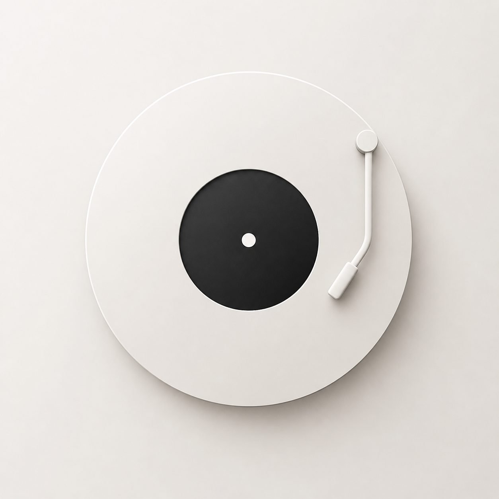

  

# 🎵 MusicSquare

> **沉浸式移动端聚合音乐播放器**
>
> 重新定义的移动端音乐体验：极致简约、全屏沉浸、多源聚合。

👉 **立即体验:** [https://theodoreye001.github.io/musicsquare/](https://theodoreye001.github.io/musicsquare/)

---

## 🌟 核心特色 (Key Features)

### 1. 沉浸式视觉美学 (Immersive UI)
- **Apple Music 灵感布局**: 采用移动端优先的全屏垂直设计，流畅的过渡动画与精致的毛玻璃 (Glassmorphism) 视觉效果。
- **智能视图切换**: 歌词页与播放列表页自动切换，封面图随状态智能缩放，视觉体验如丝般顺滑。
- **极简首页**: 以音乐为本，启动即见精美封面，隐去繁杂干扰，回归纯粹听歌体验。

### 2. 全平台聚合搜索 (Cross-Platform Search)
- **多源引擎**: 同时检索 **咪咕、网易云、QQ 音乐、酷我** 四大主流平台，海量库藏尽在掌握。
- **混合加载**: 智能交织搜索结果，支持每个平台结果数的自定义配置，不错过任何一个版本。

### 3. 高级播放控制 (Advanced Controls)
- **动态同步歌词**: 根据歌曲源头匹配歌词
- **手势触控优化**: 专为移动端设计的进度条拖拽与点击逻辑，精准定位播放时间。
- **播放模式切换**: 列表循环、单曲循环、随机播放一键切换。

### 4. 个人音乐空间 (Personal Space)
- **收藏夹系统**: 红色实心红星反馈，快速收藏心头好。
- **自建歌单**: 支持创建多个自定义歌单，通过 LocalStorage 实现数据的离线持久化。

---

## 🚀 快速开始 (Quick Start)

1. **访问地址**: [MusicSquare Live](https://theodoreye001.github.io/musicsquare/)
2. **搜索点播**: 搜索栏输入关键词（如“张国荣”），点击结果即可播放。
3. **管理歌单**: 点击右上角 `...` 按钮，可将当前歌曲加入你的专属歌单。
4. **沉浸歌词**: 播放后自动进入歌词界面，支持上下滚动与点击进度跳转。

---

## ⚖️ 免责声明 (Disclaimer)

本项目仅作为个人学习与前端技术研究之用。项目所引用的所有音乐版权归各音乐平台及原作者所有。请勿将本项目用于任何商业用途。

---

Made with ❤️ by Theodore

